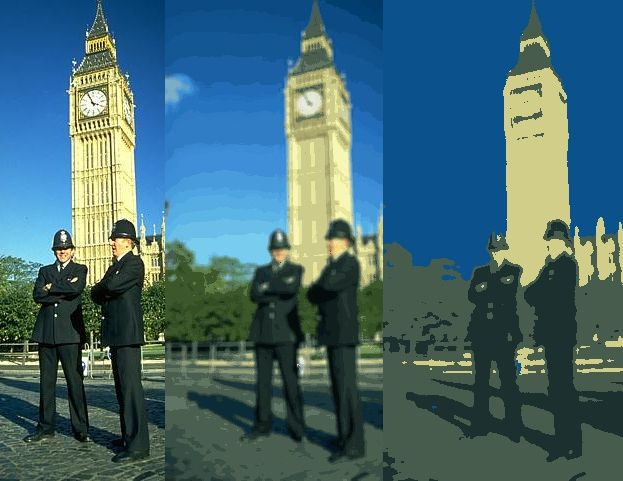

 
# Computer Vision
This repository contains different CV algorithms in Python

## Setup
I recommend creating a **virtualenv** and setting up the requirements using **Python 3.6.1**  
For **OpenCV** you can follow [this tutorial](http://cyaninfinite.com/tutorials/installing-opencv-in-ubuntu-for-python-3/).  
*If you have issues with gcc 6 you can use e.g. `sudo update-alternatives --install /usr/bin/gcc gcc /usr/bin/gcc-5 1` to prefer gcc 5 for the installation.*

## What is this ?
  - `computervision.py`: Different small functions for color splits, binary conversion, edge detection, ...
  - `mean_shift.py`: Implementation of the mean-shift algorithm. [Report](https://docs.google.com/document/d/14Db6y4Svfljd8qHcTz2Z5DY7x0skYbF07nH6m83NyfM/edit?usp=sharing)
  - `visualize.py`: Generate plots for the code. Currently only visualizations for mean-shift are implemented.
  
## Collaboration
You are very welcome to contribute and help in many different ways ! These could include, but are not limited to:  
*writing documentation, adding examples, adding results, starting discussions, writing tutorials, providing feedback, ...*

# CODE OVERVIEW
In this section the general structure of the code will be describe as well as the used frameworks. Additional information on the usage will be given as well.
The code was written on Ubuntu 16.04 with Python Version 3.6.1. It uses numpy, scipy and tqdm to handle arrays, distances and progress information. Furthermore it uses OpenCV to read and write images as well as for resizing, Gaussian blur and image presentation. Everything except for OpenCV can be installed executing the command 
            pip3 install -r requirements.txt
This assumes that pip is installed and setup. Tutorials for that can be found online.
To install OpenCV with Python 3 support it is currently required to build OpenCV from source. A detailed guide on this process can be found on the pyimagesearch blog by Adrian Rosebrock . 
On some systems there can be issues with the GCC version when building OpenCV, as version 5 is required and often version 6 is installed by default. The following command can be used to prefer GCC 5 over GCC 6.

 sudo update-alternatives --install /usr/bin/gcc gcc /usr/bin/gcc-5 1
With all the requirements set up it is now possible to execute the code. All the methods are within a file called mean_shift.py. To execute it run
             python3 mean_shift.py <image>
This command will execute the mean shift algorithm on the passed image. To further control the algorithm additional parameters can be passed. Information about them can be shown by executing 
python3 mean_shift.py --help
The core of the algorithm are the methods meanshift and find_peak. They are available optimized  and non-optimized, indicated by the suffix ‘_opt’. The image_segment methods resizes and blurs an input image and converts it colorspace for better results in mean-shift. It is advised to use this method. In addition to that the code contains three utility functions: get_neighbours get_neigbours_cdist and generate_report. The first two methods are used find points that are some distance away from another point. The ‘_cdist’ implementation calculates euclidean distances between all points, the other one uses binary trees in the form of kd-trees  which proved faster for repetitive searches in the same data points. The generate_report method can be called passing --report to the command line interface and generates eighty images with different combinations of parameters.
